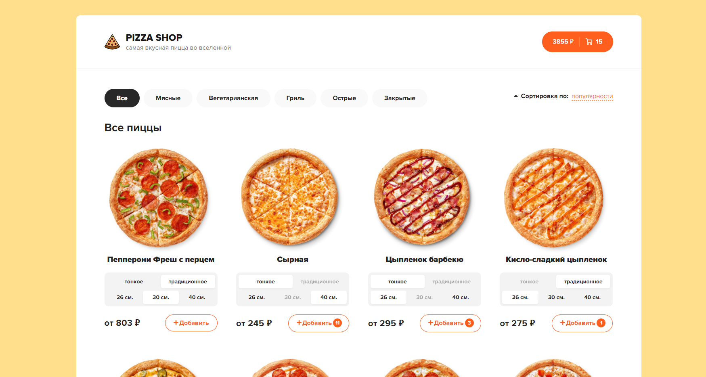

## Pizza-shop # [посмотреть](https://pizza-e-commerce.herokuapp.com/)

Тренировочный проект для работы с нативным иммутабельным Редаксом.
*Адаптив отсутствует.

*Деплой сервера находиться на Heroku

Технологии: `React / Redux / react-router-dom / json-server / SCSS`

### Функционал

1. Отображение данных с json-server
2. Фильтрация по категориям
3. Несколько видов сортировки `популярность / цена / алфавит`
4. Функционал корзины `Добавление / Удаление / Увеличение / Уменьшение` пицц в корзине
5. Скелетоны в процессе загрузки данных
